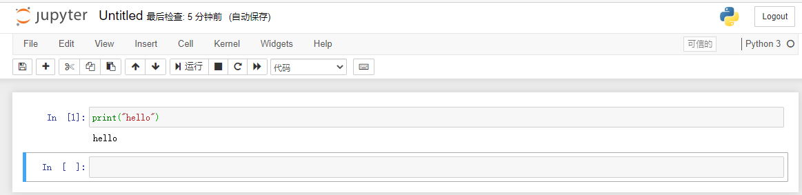
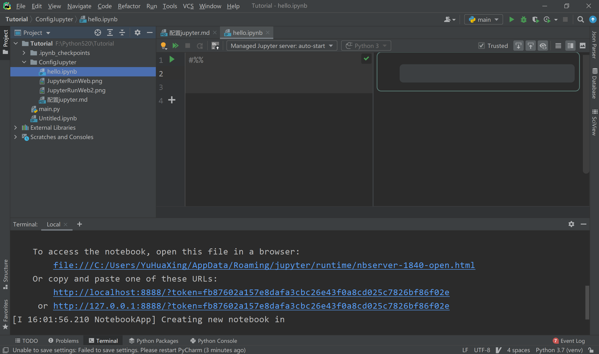
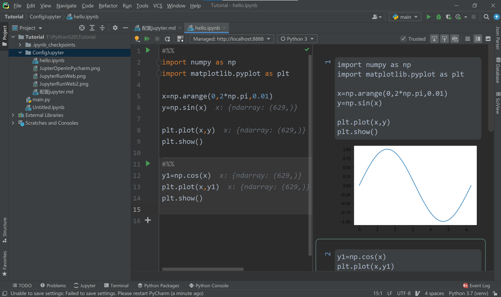

### 在Pycharm中配置Jupyter
#### 1. 准备
- pycharm专业版
#### 2. 安装
- 安装命令
  > pip install jupyter
  
- jupyter的配置设置
  - 默认即可。
  - 可以设置密码。（不用管）
- 运行在终端Terminal输入
  > jupyter notebook
  
- 运行结果
  > 生成的服务器地址为：http://localhost:8888/

- 打开网页
  * 
  * 点击`new`->`python3`可以新建一个后缀名为`.ipynb`的文件（Untitled.ipynb）
  * 该文件中写代码了`print("hello")`。
  * 最后使用快捷键`shift+enter`运行
  * 
  
- 结束终端
#### 3. 在Pycharm可直接使用（代码提示）
- 在当前项目中新建一个hello.ipynb文件
- 
- 并写入代码
```python
#%%
import numpy as np
import matplotlib.pyplot as plt

x=np.arange(0,2*np.pi,0.01)
y=np.sin(x)

plt.plot(x,y)
plt.show()

#%%
y1=np.cos(x)
plt.plot(x,y1)
plt.show()
```
- 结果显示
  * 
  * 在输出界面可以不看见代码


