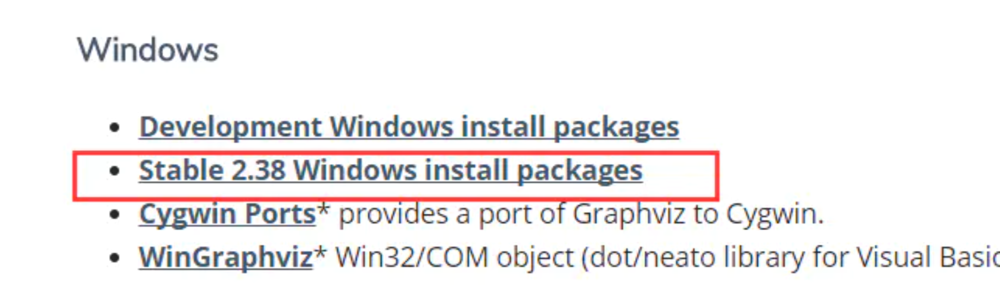
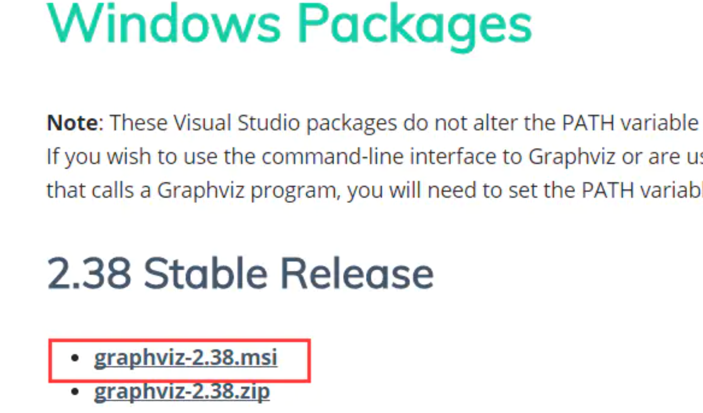

## Graphviz

---

### Graphviz 用途 

[Graphviz][1]是AT&T Labs Research开发的结构化图形绘制工具，支持多种格式输出。
它的输入是一个用dot语言编写的绘图脚本，通过对输入脚本的解析，
分析出其中的点，边以及子图，然后根据属性进行绘制。
因此可利用Graphviz可以将Sklearn生成dot格式的决策树可视化。

###安装Graphviz
Graphviz 包不能使用pip或conda进行安装.

官网下载， msi 格式的安装包  。手动安装

[下载地址](http://www.graphviz.org/download/ "点击直接转到")

选择stable版本（稳定版）



下载完后，打开点击next默认安装，

然后把 bin 默认安装路径C:\Program Files (x86)\Graphviz2.38\bin添加到系统环境变量PATH就可以使用了。

在 cmd (<kbd>win</kbd>+<kbd>r</kbd>)中输入命令`dot -version`并按回车，若显示出 Graphviz 软件的版本信息，则安装成功。

###安装pydotplus

pydotplus 是python的 API ， 它为graphviz的dot语言提供了一个python接口

pydot 是旧版本 。建议安装pydotplus。

pip或conda命令安装：

    pip install pydotplus
    conda install pydotplus


### 测试代码
代码文件 test1_graphviz.py[^1]
```python
from sklearn.datasets import load_iris
from sklearn import tree
import pydotplus

iris = load_iris()
clf = tree.DecisionTreeClassifier()
clf = clf.fit(iris.data, iris.target)

dot_data = tree.export_graphviz(clf, out_file=None,
                         feature_names=iris.feature_names,
                         class_names=iris.target_names,
                         filled=True, rounded=True,
                         special_characters=True)

graph = pydotplus.graph_from_dot_data(dot_data)
graph.write_pdf('iris.pdf')
```

---


###  <i class="fa fa-external-link-square"> </i> 相关链接

- 链接：https://www.jianshu.com/p/dd552f780a40
<!--参考超链接，能在多处使用同一链接-->
- 推荐网站[Graphviz][1]
- python3 keras中绘制卷积神经网络(CNN)网络结构-[CSDN][2]网站

----------------------------------

[1]:http://www.graphviz.org  "Graphviz"
[2]: https://blog.csdn.net/mcyJacky/article/details/88727106
[^1]: test1_graphviz.py

<!--使用 Font Awesome ，因此在文档最后添加如下代码-->
<link rel="stylesheet" href="https://cdn.bootcss.com/font-awesome/4.7.0/css/font-awesome.css">
