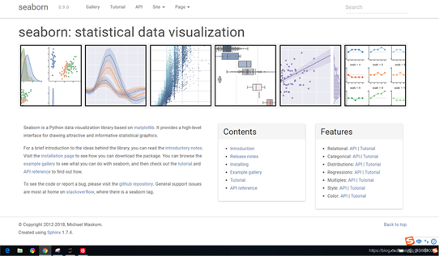
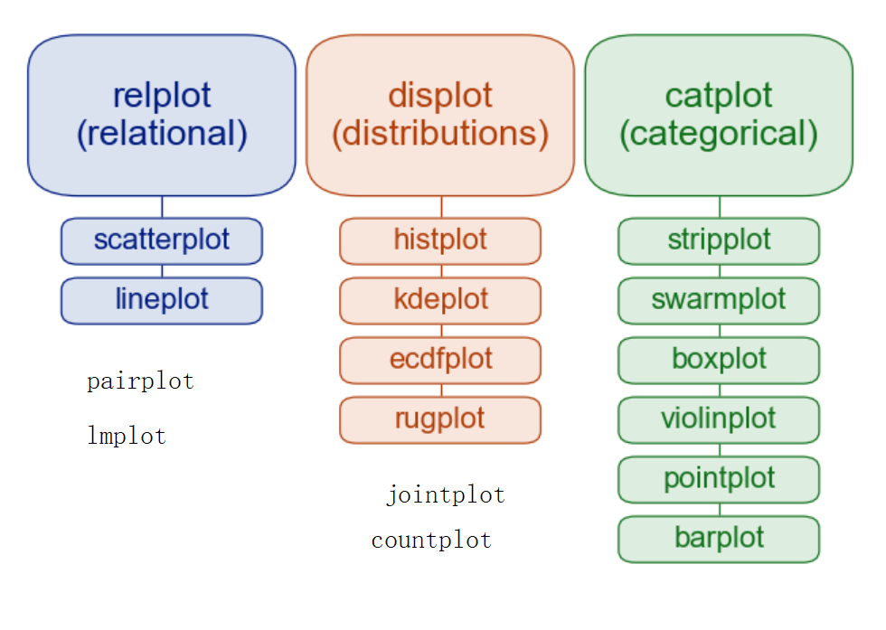

>import seaborn as sns

seaborn是python中的一个非常强大的数据可视化库，
它集成了matplotlib，下图为seaborn的官网，
如果遇到疑惑的地方可以到官网查看。
> http://seaborn.pydata.org/

图形级与轴级

参考：
Python数据可视化库seaborn的使用总结
>https://www.jb51.net/article/154644.htm

基本设置

`sns.set_style()`
seaborn默认的主题风格，里面的参数共有五种
   - darkgrid
   - whitegrid
   - dark
   - white
   - ticks

`sns.color_palette()` 获取到这些颜色
`sns.palplot()` 色块打印
seaborn里面的调色板，